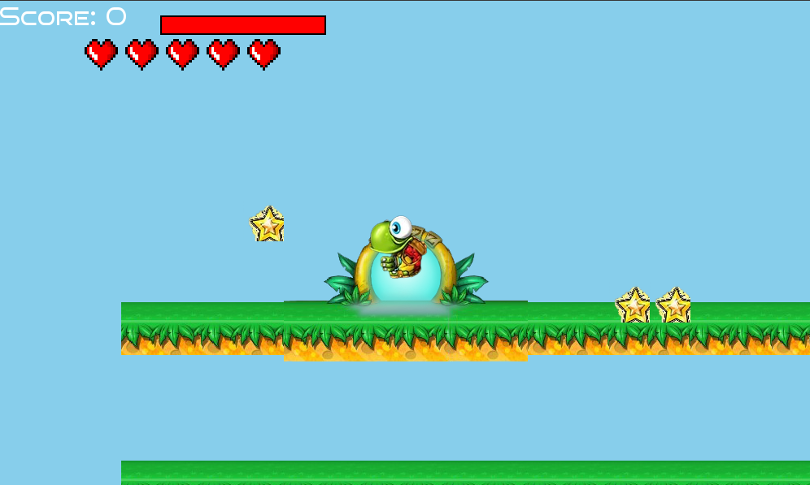
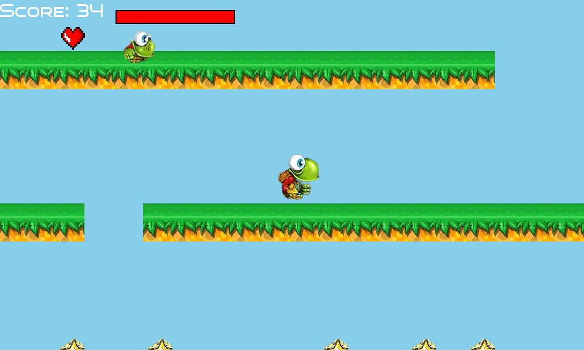
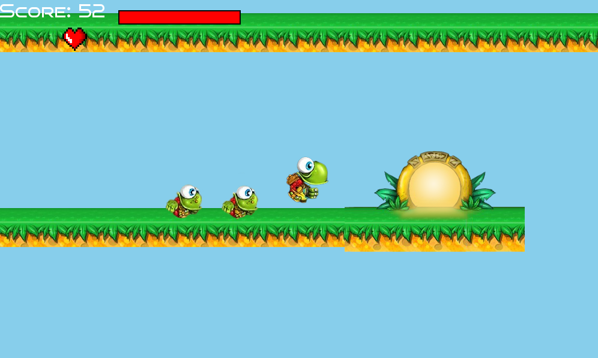
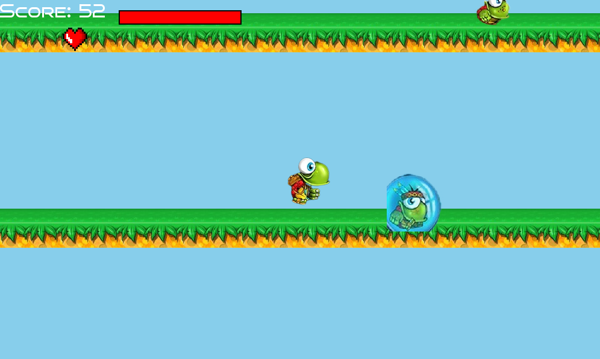

# Turtix Game

Turtix Game is a C++ game developed using the SFML library. It offers an interactive gameplay experience where players control a turtle, collecting stars and avoiding enemies across various maps. This readme provides essential information on running the game, modifying maps, and understanding the game's structure.

## Table of Contents

- [Getting Started](#getting-started)
  - [Prerequisites](#prerequisites)
  - [Building the Game](#building-the-game)
- [Gameplay](#gameplay)
  - [Controls](#controls)
- [Modifying Maps](#modifying-maps)
  - [Map Files](#map-files)
- [Screenshots](#screenshots)
- [Contributing](#contributing)
- [License](#license)

## Getting Started

### Prerequisites

To compile and run Turtix Game, you need the following:

- C++ Compiler (e.g., g++)
- SFML Library (Simple and Fast Multimedia Library)
- Make utility

Ensure you have the necessary dependencies installed on your system before proceeding.

### Building the Game

1. Clone the repository or download the source code and extract it to a directory of your choice.

`git clone github.com/tahamajs/Turtix_Game.git`

3. Open a terminal and navigate to the game directory.

`cd Turtix_Game`

5. Use the provided makefile to build the game.
   
`make `

## Gameplay

The goal of Turtix Game is to control the turtle character, collect stars, and avoid enemies to reach the end of each map. The game features multiple maps, each with varying levels of difficulty.

### Controls

- **Arrow keys:** Move the turtle character.
- **Spacebar:** Jump.
- **Esc:** Pause the game.

## Modifying Maps

You can customize Turtix Game by modifying the map files located in the `maps` folder. These map files contain data that define the positions of various gameplay elements such as stars, enemies, and other interactive objects.

### Map Files

Each map file represents a game level and follows a specific format to define the positions of elements:

- **Playground Tiles:** The layout of the playground is defined using lines in the format `TILE x y type`, where `x` and `y` are the coordinates of the tile and `type` specifies the tile type.

- **Stars:** The positions of stars are specified as lines in the format `Star type x y`.

- **Turtle Child:** The positions of turtle children are defined with lines in the format `type x y`.

- **Enemies:** Similarly, enemy positions are specified using lines in the format `type x y`.

To customize the maps:

1. Navigate to the `maps` folder in the game directory.
2. Open the map file corresponding to the level you want to modify using a text editor.
3. Locate the sections of the file that define the positions of playground tiles, stars, turtle children, and enemies.
4. Adjust the coordinates and types as needed to change the positions and types of elements.
5. Save the changes and run the game to see your modifications take effect.

Refer to the comments within the map files for guidance on the specific format used for specifying coordinates and types.

Feel free to experiment with the map files and modify the positions and types of elements to create new levels, challenges, and experiences within the game.
## Screenshots

_Gameplay screenshot showcasing the turtle character collecting stars._

## Contributing

Contributions are welcome! If you'd like to make improvements or add new features, fork this repository, create a new branch, and submit a pull request.

## License

This project is licensed under the [MIT License](LICENSE).

---

Have fun playing and customizing Turtix Game! If you encounter any issues or have questions, feel free to contact us at [taha.maj4@email.com](mailto:taha.maj4@email.com).

